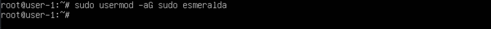
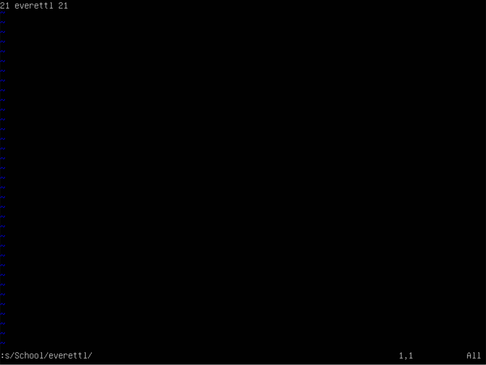
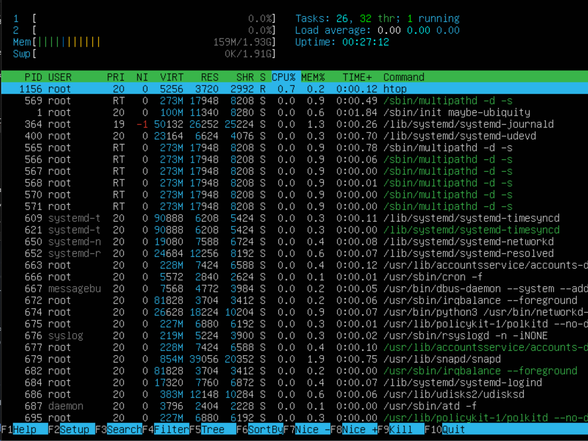
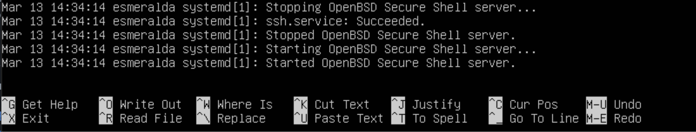
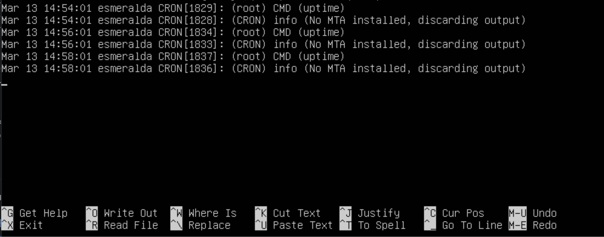

# Операционные системы UNIX/Linux (Базовый).

## Part 1. Установка ОС

1. Установил `Ubuntu 20.04 Server LTS` без графического интерфейса и узнал версию Ubuntu, выполнив команду `cat /etc/issue`

## Part 2. Создание пользователя

1. Создал нового пользователя командой `useradd esmeralda`

2. Добавил пользователя в группу adm, выполнив команду `usermod -aG adm esmeralda`

3. Вывод команды `cat /etc/passwd`

## Part 3. Настройка сети ОС

#### Задание названия машины вида user-1

1. Задал название машины командой `hostnamectl set-hostname user-1`

#### Установка временной зоны, соответствующей текущему местоположению

2. Установил временную зону в соответствии с текущим местоположением командой `timedatectl set-timezone Europe/Moscow`

#### Вывод названия сетевых интерфейсов с помощью консольной команды

3. Вывел название сетевых интерфейсов командой `ip a`

>lo (loopback device) – виртуальный интерфейс, присутствующий по умолчанию в любом Linux. Он используется для отладки сетевых программ и запуска серверных приложений на локальной машине. С этим интерфейсом всегда связан адрес 127.0.0.1. У него есть dns-имя – localhost.

#### Используя консольную команду, получаю ip адрес устройства, на котором работаю, от DHCP сервера

4. Комндой `ip address` получил ip адрес устройства, на котором работаю, от DHCP сервера. Командой `hostname -I` выводим все сетевые адреса системы, кроме интерфейса loopback

>DHCP (англ. Dynamic Host Configuration Protocol — протокол динамической настройки узла) — сетевой протокол, позволяющий сетевым устройствам автоматически получать IP-адрес и другие параметры, необходимые для работы в сети TCP/IP. Данный протокол работает по модели «клиент-сервер». Для автоматической конфигурации компьютер-клиент на этапе конфигурации сетевого устройства обращается к так называемому серверу DHCP и получает от него нужные параметры.

#### Определение и вывод на экран внешнего ip-адреса шлюза (ip) и внутреннего IP-адрес шлюза, он же ip-адрес по умолчанию (gw)

5. Определил внешний ip командой `curl ifconfig.me` и внутренний `ip r`

#### Задание статичных (заданные вручную, а не полученные от DHCP сервера) настроек ip, gw, dns (используя публичный DNS серверы, например 1.1.1.1 или 8.8.8.8)

6. Открыл файл конфигурации командой `nano /etc/netplan/00-installer-config.yaml`, внес необходимые данные и ввел команду `netplan apply`, которая проверит конфиг на наличие ошибок и применит его в случае успеха

#### Перезагрузка виртуальной машины. Убеждаюсь, что статичные сетевые настройки (ip, gw, dns) соответствуют заданным в предыдущем пункте

7. Перезапустил машину командой `reboot now` и успешно пропинговал удаленные хосты 1.1.1.1 и ya.ru

## Part 4. Обновление ОС

#### Обновление системных пакетов до последней на момент выполнения задания версии

1. Запустил обновление системных пакетов командой `sudo apt upgrade`

## Part 5. Использование команды **sudo**

>sudo (англ. Substitute User and do, дословно «подменить пользователя и выполнить») — программа для системного администрирования UNIX-систем, позволяющая делегировать те или иные привилегированные ресурсы пользователям с ведением протокола работы. Основная идея — дать пользователям как можно меньше прав, при этом достаточных для решения поставленных задач.

#### Разрешение пользователю, созданному в Part 2, выполнять команду sudo

1. Добавил пользователя в группу sudo командой `sudo usermod -aG sudo`

2. Переключился на пользователя 'esmeralda' с помощью команды `su` и изменил имя хоста командой sudo `sudo hostnamectl set-hostname`

## Part 6. Установка и настройка службы времени

#### Настройка службы автоматической синхронизации времени

1. Вывел время часового пояса, в котором сейчас нахожусь командой `timedateclt` и проверил содержание командой `timedatectl show`

## Part 7. Установка и использование текстовых редакторов

#### Установка текстовых редакторов **VIM** (+ любые два по желанию **NANO**, **MCEDIT**, **JOE** и т.д.)

1. Установил VIM `sudo apt install vim`, JOE `sudo apt install joe` и NANO `sudo apt install nano`

#### Используя каждый из трех выбранных редакторов, создай файл *test_X.txt*, где X -- название редактора, в котором создан файл. Напиши в нём свой никнейм, закрой файл с сохранением изменений

2. Создал файл командой `vim test_VIM.txt`, записал никнейм и вышел с сохранением изменений, введя команду `:wq`

3. Создал файл командой `nano test_nano.txt`, записал никнейм и вышел с сохранением изменений, введя команду `ctrl + x` - выход из редактора. `Y` - соглашение с сохранением`

4. Создал файл командой `joe test_JOE.txt`, записал никнейм и вышел с сохранением изменений, введя команду `ctrl + k + q` - выход из редактора. `y` - соглашение с сохранением`

#### Используя каждый из трех выбранных редакторов, открой файл на редактирование, отредактируй файл, заменив никнейм на строку «21 School 21», закрой файл без сохранения изменений

5. Открыл файл командой `vim test_VIM.txt`, заменил никнейм на строку «21 School 21» и закрыл файл без сохранения изменений, введя команду `:q!`

6. Открыл файл командой `nano test_nano.txt`, заменил никнейм на строку «21 School 21» и закрыл файл без сохранения изменений, введя команду `ctrl + x` - выход из редактора. `N` - отказ от сохранения`

7. Открыл файл командой `joe test_JOE.txt`, заменил никнейм на строку «21 School 21» и закрыл файл без сохранения изменений, введя команду `sctrl + k + q` - выход из редактора. `y` - отказ от сохранения`

#### Используя каждый из трех выбранных редакторов, отредактируй файл ещё раз (по аналогии с предыдущим пунктом), а затем освой функции поиска по содержимому файла (слово) и замены слова на любое другое

8. Осуществил поиск слова командой `/\<School\>` и замену командой `:s/School/everettl/`

9. Осуществил поиск слова и замену командой `ctrl + \`

10. Осуществил поиск слова командой `ctrl + k + f` и замену командой `R`

## Part 8. Установка и базовая настройка сервиса **SSHD**

#### Установка службы SSHd

1. Установил SSHd командой `sudo apt install openssh-server`

#### Добавление автостарта службы при загрузке системы

2. Добавил автостарт службы командой `sudo systemctl enable ssh`

3. Проверил, работает ли служба командой `systemctl status ssh`

#### Перенастройка службы SSHd на порт 2022

4. Перенастроил службу SSHd на порт 2022 командой `nano /etc/ssh/sshd_config`

#### Используя команду ps, показание наличия процесса sshd. Подобр ключей

>ps aux

- a — указывает ps вывести на дисплей процессы всех пользователей, за исключением тех процессов, которые не связаны с терминалом и процессами группы лидеров.

- u — подставки для ориентированных на пользователя формате, который обеспечивает подробную информацию о процессах.

- x — перечисляет процессы без управляющего терминала. В основном это процессы, которые запускаются во время загрузки и работают в фоновом режиме.

5. Показал наличие процесса sshd с помощью команды `ps aux | grep sshd`

#### Перезагрузка системы

6. Перезапустил систему командой `reboot now`

7. Установил netstat командой `apt install net-tools`

8. Выполнил команду `netstat -tan`

> netstat - отображение статистики сетевых соединений.

- -a - показывает состояние всех сокетов; обычно сокеты, используемые серверными процессами, не показываются
- -n - показывает сетевые адреса как числа. netstat обычно показывает адреса как символы
- -t - отображает TCP подключения
- Proto - содержит тип протокола
- Recv-Q - счётчик байтов не скопированных программой пользователя из этого сокета
- Send-Q - счётчик байтов, не подтверждённых удалённым узлом
- Local Address - адрес и номер порта локального конца сокета
- Foreign Address - адрес и номер порта удалённого конца сокета
- State - состояние сокета
- LISTEN - сокет, ожидающий входящих подключений
- SYN_SENT - сокет, находящийся в режиме активной попытки установки подключения
- 0.0.0.0 - немаршрутизируемый адрес IPv4, который используется в качестве адреса по умолчанию или адреса-заполнителя

## Part 9. Установка и использование утилит **top**, **htop**

#### Установи и запусти утилиты top и htop

1. Установил пакет Procps командой `apt install procps`

2. Вывел команду top

- uptime: 13 min
- кол-во авторизованных пользователей: 1 user
- общую загрузку системы: 0.00, 0.00, 0.00
- общее количество процессов: 104 total, 1 running, 103 sleeping, 0 stopped, 0 zombie
- загрузку cpu: %Cpu(s): 0.0 us, 0.0 sy, 0.0 ni, 99.8 id, 0.2 wa, 0.0 hi, 0.0 si, 0.0 st
- загрузку памяти: MiB Mem : 1971.4 total, 1506.1 free, 157.8 used, 307.4 buff/cache
- pid процесса занимающего больше всего памяти: 677
- pid процесса, занимающего больше всего процессорного времени: 10

3. Вывод команды htop отсортированный по PID

4. Вывод команды htop отсортированный по PERCENT_CPU

5. Вывод команды htop отсортированный по PERCENT_MEM

6. Вывод команды htop отсортированный по TIME

7. Вывод команды htop отсортированный для процесса sshd

8. Вывод команды htop с процессом syslog, найденным, используя поиск

9. Вывод команды htop с добавленным выводом hostname, clock и uptime

## Part 10. Использование утилиты **fdisk**

#### Запуск команды fdisk -l

1. Запустил утилиту командой `fdisk -l`

- название жесткого диска: VBOX HARDDISK
- размер: 20 GiB
- количество секторов: 41943040

2. Ввел команду `swapon --show`

- размер swap: 1.9 GiB

## Part 11. Использование утилиты **df**

#### Запуск команду df

1. Запустил утилиту командой `df`

Отчет для корневого раздела(/):
- размер раздела: 10218772
- размер занятого пространства: 4839680
- размер свободного пространства: 4838420
- процент использования: 51%

Единицы измерения: 1K

#### Запуск команду df -Th

2. Запустил утилиту командой `df -Th`

>T - показывает тип файловой системы
>h - выводит размеры в читаемом виде, в мегабайтах или гигабайтах

Отчет для корневого раздела(/):
- размер раздела: 9.8G
- размер занятого пространства: 4.7G
- размер свободного пространства: 4.7G
- процент использования: 51%

Тип файловой системы для раздела: ext4

## Part 12. Использование утилиты **du**

#### Запуск команду du

1. Запустил утилиту командой `du`

#### Вывод размера папок /home, /var, /var/log (в байтах, в человекочитаемом виде)

2. Запустил утилиту с флагами командой `du -sh /home /var /var/log`

#### Вывод размера всего содержимого в /var/log (не общее, а каждого вложенного элемента, используя *)

3. Запустил утилиту командой `du -sh /var/log/*`

## Part 13. Установка и использование утилиты **ncdu**

#### Установка утилиты ncdu

1. Установил утилиту ncdu командой `apt install ncdu`

#### Вывод размера папок /home, /var, /var/log

2. Вывел размер папки /home командой `sudo ncdu /home`

3. Вывел размер папки /var командой `sudo ncdu /var`

4. Вывел размер папки /var/log командой `sudo ncdu /var/log`

## Part 14. Работа с системными журналами

#### /var/log/dmesg

1. Открыл для просмотра командой `nano /var/log/dmesg`

>dmesg — в этом логе хранится информация о загрузке ядра и драйверов оборудования. В момент загрузки системы записывается вся основная информация, имеющая к ней отношение

#### /var/log/syslog

2. Открыл для просмотра командой `nano /var/log/syslog`

>syslog - глобальные системные журналы операционной системы linux. Сюда пишутся события загрузки, ядра системы, системы инициализации systemd и т.д

#### /var/log/auth.log 

3. Открыл для просмотра командой `nano /var/log/auth.log`

>auth.log — лог авторизации и аутентификации в системе, в том числе ssh

- время последней успешной авторизации: Mar 10 14:41:04
- имя пользователя: everettl
- метод входа в систему: TTY=tty1

#### Перезапуск sshd

4. Перезапустил sshd командой `systemctl restart sshd`

## Part 15. Использование планировщика заданий **CRON**

>Cron (Command Run ON) — система для автоматического запуска программ и скриптов на сервере в определённое время

#### Используя планировщик заданий, запуск команды uptime через каждые 2 минуты

1. Вошел в журнал для записи заданий командой `crontab -e` и добавил задание `*/2 * * * * uptime`

2. Просмотрел логи с помощью команды `nano /var/log/syslog`

3. Вывел список текущих задач для CRON командой `crontab -l`

#### Удаление всех заданий из планировщика заданий

4. Удалил все задания и проверяю список задач `crontab -r` `crontab -l`

